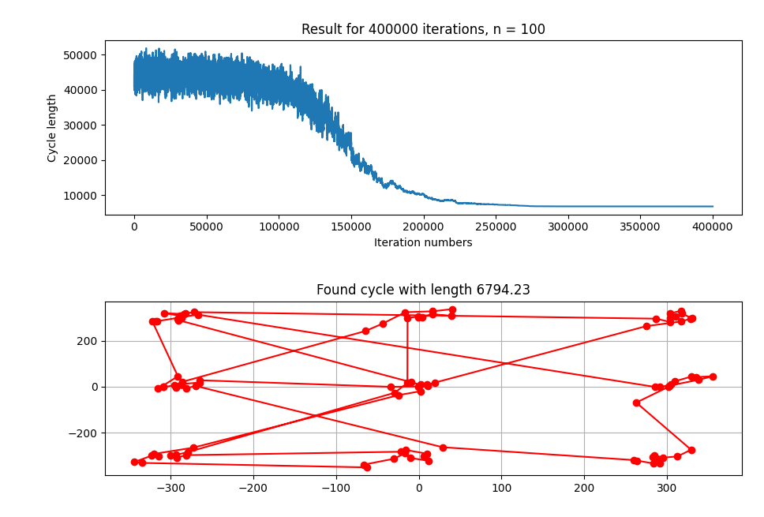
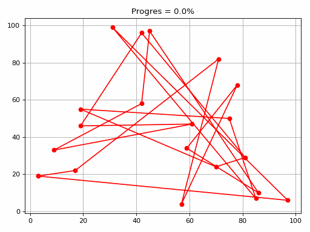
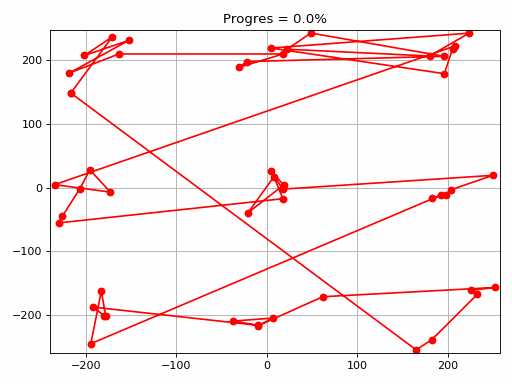

# Simulated-Annealing
Repository showcases simulated annealing capabilities and how cool it is.

## Introduction
Simulated annealing is a metaheuristic algorithm that allows us to find approximation of a solution for very complex problems in relatively short amount of time. The most important aspects of this algorithm are:

- **energy** - in every problem we define **energy** and ways of calculating it for every **state** our algorithm is in. Our algorithm will try to minimize this energy.

- **state** - while the algorithm is running we are checking different arrangements of initial arguments of a program and calculate **energy** for each of them.

- **temperature** - when we are considering a new **state** in our algorithm we want to drift towards states with lower **energy** (since we are looking for a state with minimal value of it). However if we were to choose lower **energy** state every time, we would end up stuck in a local minimum and never reach global one. That is when **temperature** kicks in. If the temperature is high than we have high probability of choosing state with higher **energy** than the current one. **Temperature** decreases over time which means the probability of choosing worse state decreases as well.

Enough chit-chat, let's see this in action.

## Download

```
git clone git@github.com:AdrianSuliga/Simulated-Annealing.git
cd Simulated-Annealing
python3 -m venv .
source bin/activate
pip3 install -r requirements.txt
```

## Traveling Salesman Problem
In this problem we are given a cloud of 2D points and we want to find shortest cycle that goes through each of them. This is a classic problem that showcases usage of simulated annealing. We define **energy** as length of current cycle, **state** is a list of 2D points sorted in order in which we want to visit them. Implementation of this is prepared in ```tsp.py``` file. My program is expecting a few command line arguments that let you customize how it is working. The usage goes like this
```
python3 tsp.py [--gif] <number_of_points> <how_to_generate_points> <max_iteration> <initial_temperature> <neighbour_function> <distance_metric>  
```

- ```--gif``` is a flag, if set my program will generate GIF showcasing how tha algorithm is working. It is optional because generating GIFs is time consuming for high number of iterations.
- ```<number_of_points>``` is a number of... 2D points to generate like this is self-explanatory.
- ```<how_to_generate>``` is one of chars ```r```, ```n```, ```g```. If you choose ```r```, data will be generated randomly, ```g``` generates points in 9 clusters separated from each other while ```n``` only in 3 clusters.
- ```<max_iteration>``` is a number of iterations algorithm should do. It is advisable to set this number to a high value like ```100 000``` or more.
- ```<initial_temperatur>``` is a starting temperature for simulated annealing algorithm, you can start by setting it to be 1 / 10 of ```<max_iteration>``` and than well feel free to experiment.
- ```<neighbour_function>``` is one of chars ```r``` or ```c```. Choosing ```r``` will choose next **state** of our program by drawing and swapping 2 random points, while ```c``` only draws one and swaps it with its neighbour.
- ```<distance_metric>``` is one of chars ```e``` or ```m```. You basically choose how to define distance between two points. ```e``` stands for euclidean distance ($\sqrt{\left( x_{1} - y_{1} \right)^{2} + \left( x_{2} - y_{2} \right)^{2}}$) while ```m``` is manhatan distance ($\left| x_{1} - x_{2} \right| + \left| y_{1} - y_{2} \right|$).

Now is the time for an example, running
```
python3 tsp.py 100 g 400000 30000 r e
```
will result in something like



If you chose to make GIF you will end up with cool animation like these ones:






## Binary image
